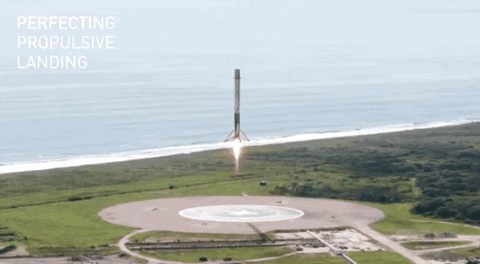

# Galactic Predictor

Galactic Predictor is a data analysis project focused on studying the success rates of SpaceX's unmanned rocket launches. The goal is to uncover patterns, trends, and key factors that influence the outcomes of these missions. By leveraging historical launch data, the project aims to provide actionable insights that could help improve future mission planning and execution. The analysis covers the entire data science workflow, from data collection to model deployment, ensuring a comprehensive understanding of the problem domain.

## Data Analysis Phases

| Phase                | Description                                                                                   |
|----------------------|-----------------------------------------------------------------------------------------------|
| 1. Data Collection   | Gathering raw data from SpaceX launch records, public datasets, and relevant APIs.            |
| 2. Data Cleaning     | Removing inconsistencies, handling missing values, and preparing the data for analysis.        |
| 3. Exploratory Analysis | Visualizing and summarizing the data to identify trends, anomalies, and relationships.     |
| 4. Feature Engineering | Creating new variables and selecting relevant features to improve model performance.        |
| 5. Modeling          | Applying statistical and machine learning models to predict launch success.                   |
| 6. Evaluation        | Assessing model accuracy and reliability using appropriate metrics and validation techniques. |
| 7. Deployment        | Integrating the predictive model into a usable application or reporting system.               |

### This project aims to identify and analyze the underlying patterns associated with successful and unsuccessful SpaceX rocket launches.

#### A successful launch is illustrated below:

#### Conversely, the following image represents an unsuccessful launch outcome:

